# ZenZone - Meditation App

## 🧘‍♂️ Overview

**ZenZone** offers users to listen to meditation tracks, practice guided breathing exercises, set daily meditation reminders, and track their favorite meditations.

## 🛠️ Tech Stack

- **SwiftUI** – for building the app’s user interface  
- **Core Motion** – for tracking device movement via the accelerometer  
- **AVKit** – for playing audio files  
- **UserDefaults** – for storing user data, such as favorite meditations and profile information  
- **PhotosUI** – for selecting a profile picture  

## 🖥️ App Preview

  <video src="https://github.com/thephenom00/iOS-meditation-app/assets/133682647/7d9968c5-3120-4fd4-841b-d328f9e15c91">
  </video>

### Home Screen
Users can choose between guided breathing exercises or listening to meditation tracks.  

    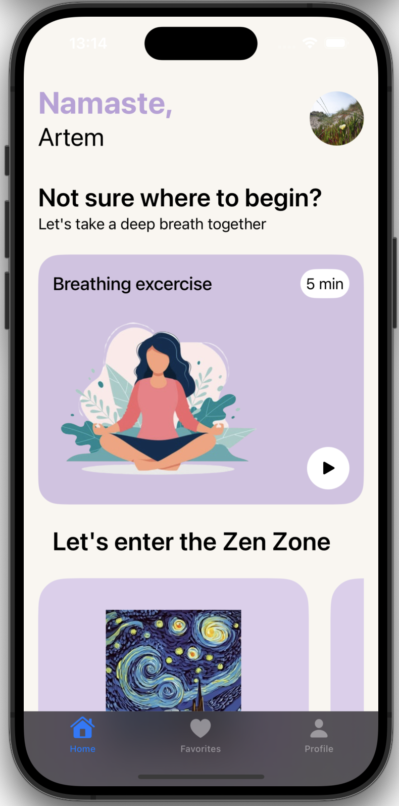

  

---

### Breathing Exercises
Users select a color theme, then follow a visual animation to guide their breathing practice.  

    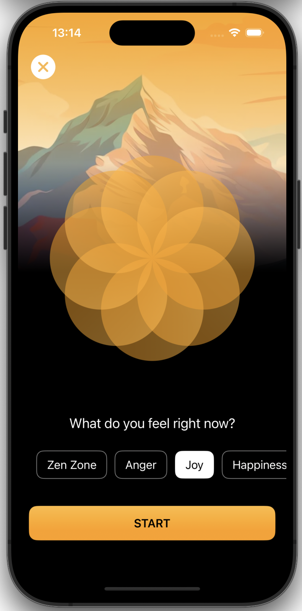
    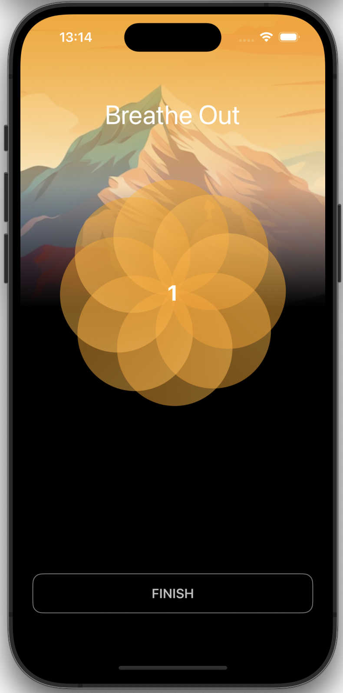

  

---

### Play a Meditation Track
Selecting a track opens detailed information. Click **Play** to start the track, with controls for pause, skip, or repeat.  

    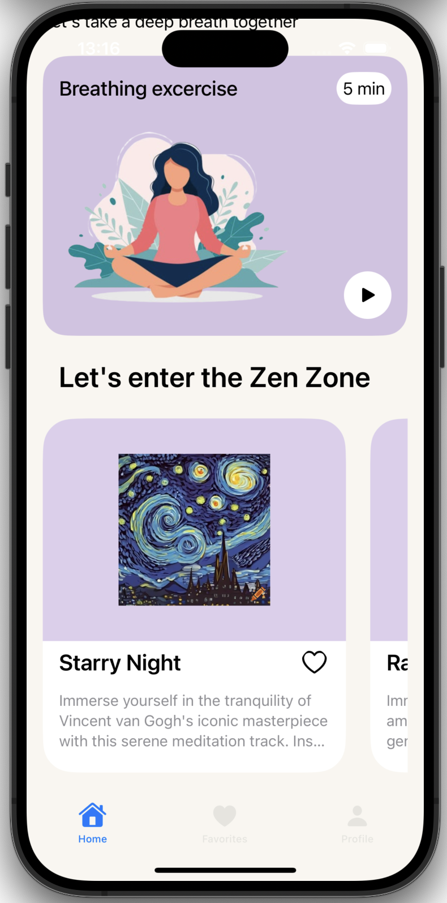
    
    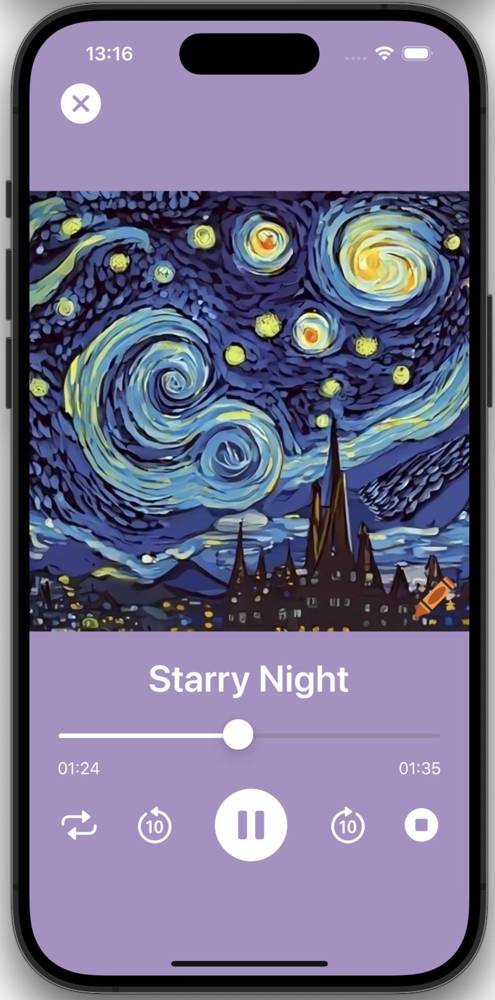

  

---

### Motion Detection
If the device is moved while a track is playing, a notification alert is shown.  

    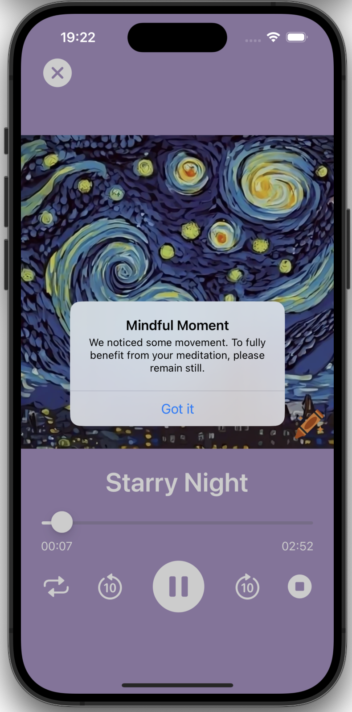

  

---

### Favorite Meditations
Displays all tracks the user has marked as favorites. Add a track by tapping the heart icon.  

    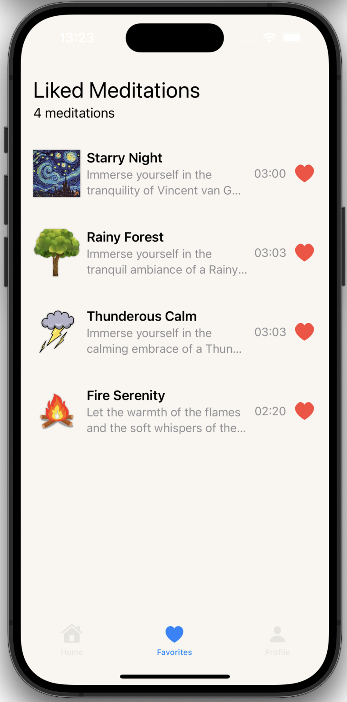

  

---

### User Profile
Users can change their profile picture, username, and set daily meditation reminders.  

    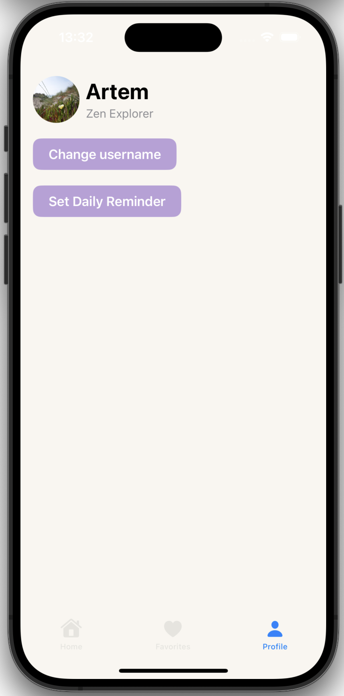

  

---

### Change Profile Picture & Username

    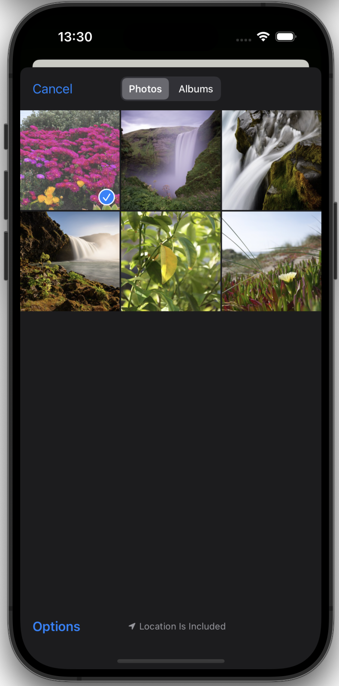
    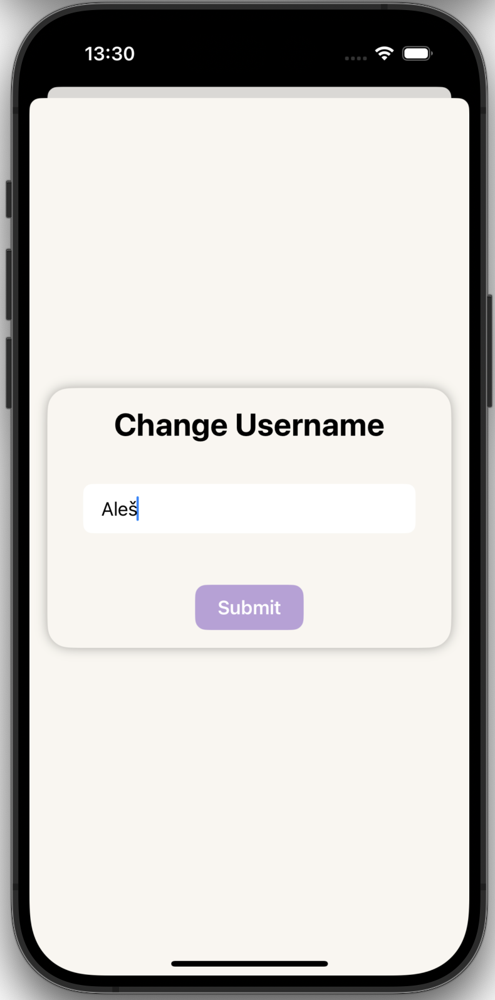
    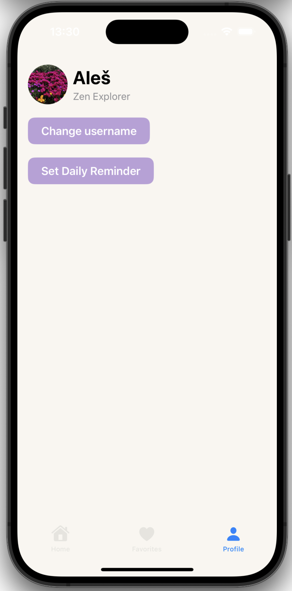

  

---

### Set Meditation Reminder

    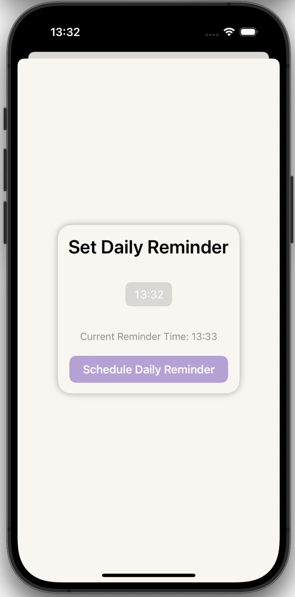
    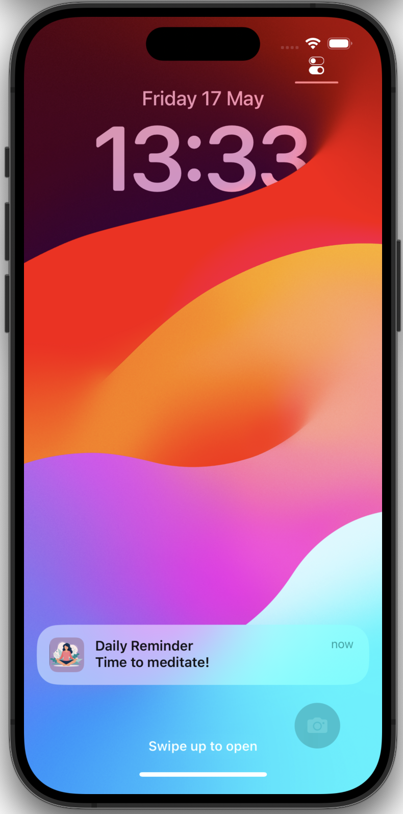

  
